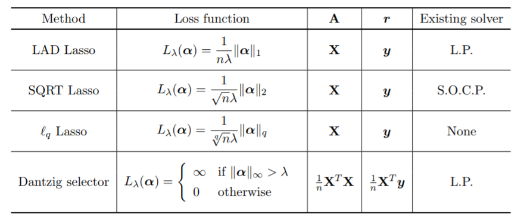

```{r setup, include=FALSE}
knitr::opts_chunk$set(echo = FALSE)
```

## Methodology 

### Simulate data  
  + n = 1000
  + p = 50 
  + 0 $\leq$ proportion of unrelated features  $\leq$ 1
  + random from standard normal, exponential and uniform distributions
  + 0 $\leq$ proportion of missing values < 1
  + Missing Completely at Random (MCAR) 

## Methodology 

### Imputation
  + mean
  + median
  + bagging
  + KNN


## Goals

### 1. Sensitivity of LASSO with missing values

### 2. Compare LASSO and Dantzig Selector 

## LASSO and Dantzig Selector

+ Methods for feature selection by penalized regression 

+ Family of LASSO [1]

```{r, out.width="80%"}

```

## Result 1: Sensitivity of LASSO with missing values

## {data-background="naomit.png"}

## {data-background="mean_median.png"}

## {data-background="knn_bagged.png"}

## Result 2: Compare LASSO and Dantzig Selector

+ Proportion of missing data: 30% 
+ Without unrelated features 

## {data-background="result2.png"}


## Summary

### Result 1  
+ The higher proportion of missing data the worse performance of LASSO 

### Result 2  
+ Do not show big difference between two models 
+ Absolute values of coefficients bigger for Dantzig Selector 

### Future work  
+ Compare LASSO and Dantzig Selector under different proportions of unrelated features 


## Reference

[1] X. Li, T. Zhao, X. Yuan, and H. Liu. An R package flare for high dimensional linear regression and
precision matrix estimation. http://cran.r-project.org/web/packages/flare, 2015.